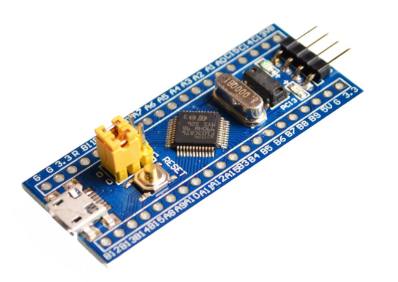

# Дрыгалка

Программа предназначена для проверки SPI в других проектах.

Программа работает SPI-мастером и выдает посылку из 32 байт. Принимает ее обратно. Если принятая посылкка не совпадает с отправленной, то зажигается светодиод.

* Микроконтроллер stm32f103c8t6
* Плата BluePill.
* PC13 = светодиод
* PB12 = NSS
* PB13 = SCK
* PB14 = MISO
* PB15 = MOSI

